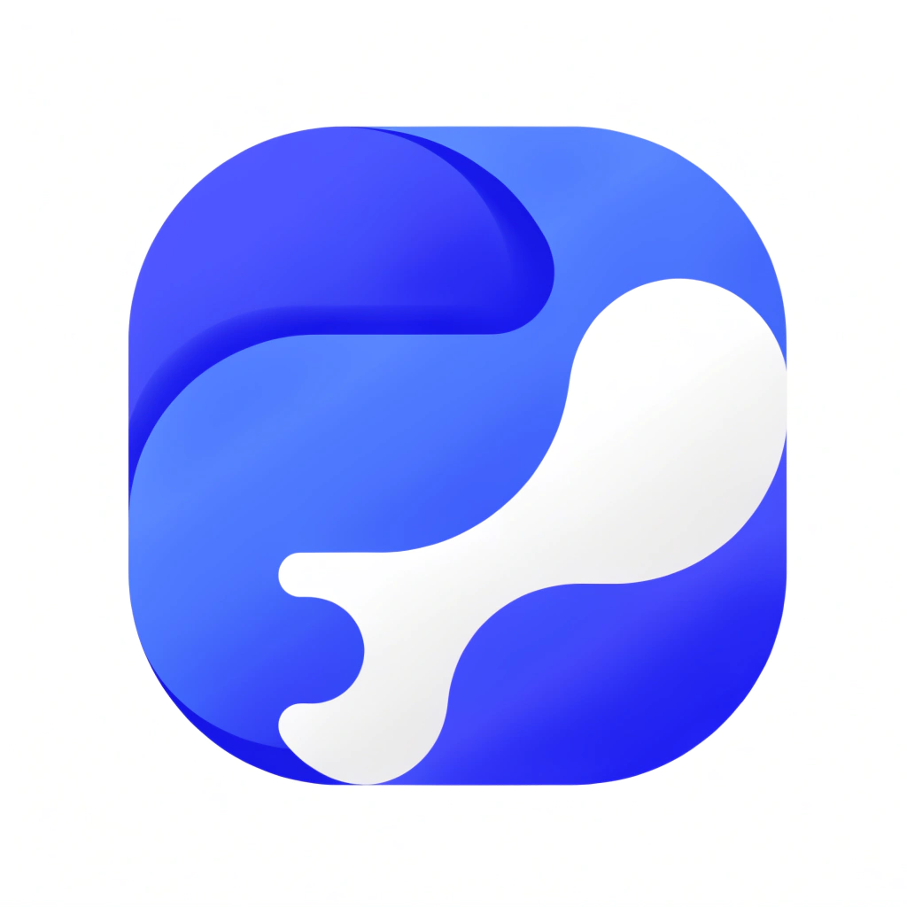
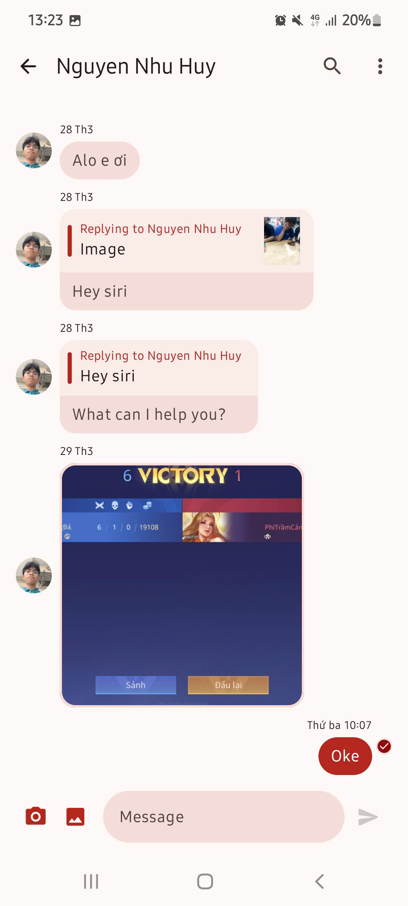
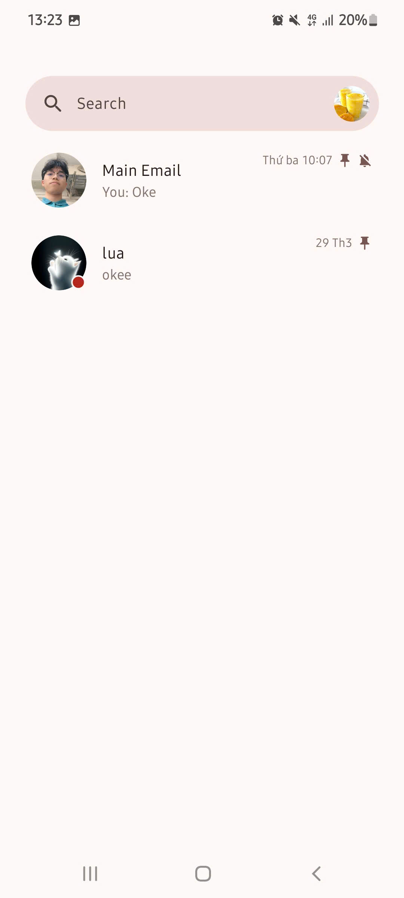
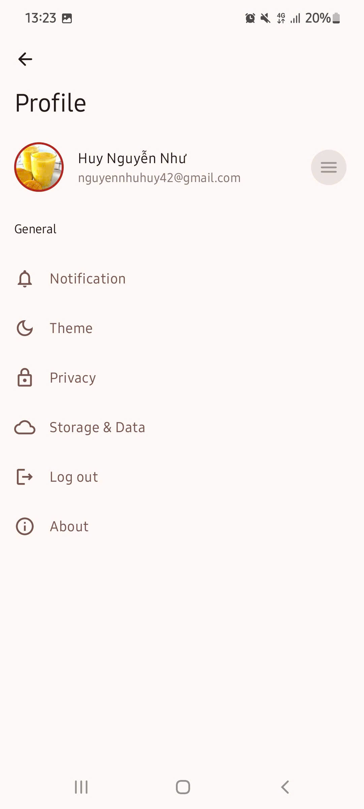
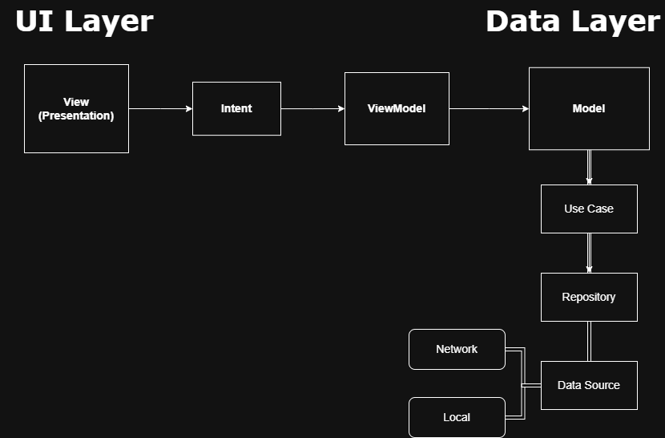
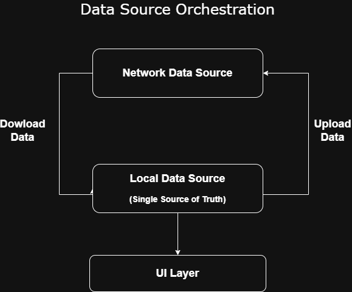
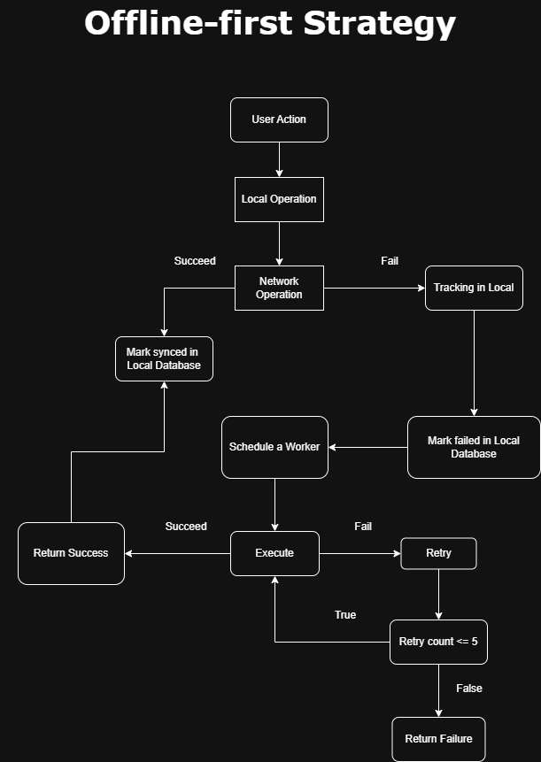

<p align="center">
  
</p>

<h1 align=center>Replee</h1>

<p align="center">
  
  
  
  
  
  
</p>


<p align=center>🔨 Modern Realtime 1v1 Chat: Jetpack Compose + Firebase + Room. Offline-first architecture with Material 3. 🚀💨</p>


<p align="center">
  
   
  
</p>

## 🧰 Tech Stack & Open Source Libraries

### 📱 Core Configuration

- **Minimum SDK**: 30 (Android 11)
- **Language**: [Kotlin](https://kotlinlang.org/)
  - Utilizes [Coroutines](https://kotlinlang.org/docs/coroutines-overview.html) & [Flow](https://kotlinlang.org/docs/flow.html) for reactive and asynchronous programming

### 🧩 Jetpack Components

- [Jetpack Compose](https://developer.android.com/jetpack/compose) – Modern toolkit for building native UI
- [Navigation](https://developer.android.com/guide/navigation) (v3) – Type-safe and flexible screen navigation
- [Hilt](https://developer.android.com/training/dependency-injection/hilt-android) – Dependency Injection (DI)
- [Room Database](https://developer.android.com/training/data-storage/room) – Local persistence for offline support
- [Paging 3](https://developer.android.com/topic/libraries/architecture/paging/v3-overview) – Efficient large dataset loading
- [ViewModel](https://developer.android.com/topic/libraries/architecture/viewmodel) – Lifecycle-aware state management
- [WorkManager](https://developer.android.com/topic/libraries/architecture/workmanager) – Background task scheduling
- [DataStore](https://developer.android.com/topic/libraries/architecture/datastore) – Modern key-value storage for preferences

### ☁️ Cloud Services & Backend

- [Firebase](https://firebase.google.com/) Ecosystem
  - [Authentication](https://firebase.google.com/docs/auth) – Email & Google Sign-In
  - [Cloud Firestore](https://firebase.google.com/docs/firestore) – Real-time NoSQL database
  - [Cloud Messaging (FCM)](https://firebase.google.com/docs/cloud-messaging) – Push notifications

- **Backend:**
  - [Node.js](https://nodejs.org/) with ([TypeScript](https://www.typescriptlang.org/)) deployed on [Vercel](https://vercel.com/): acts as middleware for FCM and custom business logic
> [!TIP]
> You can checkout [Backend For Replee](https://github.com/NhuHuy-79/replee-backend) here.
  - [Cloudinary](https://cloudinary.com/): Media upload, storage, and transformation

### 🌐 Networking & Media

- [Retrofit](https://square.github.io/retrofit/) & [Gson](https://github.com/google/gson) – HTTP client & JSON parsing
- [Coil](https://coil-kt.github.io/coil/) – Image loading and caching
- [Zoomable](https://github.com/usuiat/Zoomable) – Pinch-to-zoom support for images

### 🎨 UI/UX & Utilities

- [MaterialKolor](https://github.com/material-foundation/material-color-utilities) – Dynamic Material 3 color generation
- [Timber](https://github.com/JakeWharton/timber) – Logging utility
- [unDraw](https://undraw.co/) – Customizable illustrations
- [Flow Operator](https://github.com/skydoves/flow-operators) – Simplifies complex Flow transformations

### 🧪 Testing

- [Truth](https://truth.dev/) – Readable assertions
- [MockK](https://mockk.io/) – Kotlin-first mocking library
- [Coroutines Test](https://kotlinlang.org/api/kotlinx.coroutines/kotlinx-coroutines-test/) – Testing suspend functions
- [Turbine](https://github.com/cashapp/turbine) – Testing Kotlin Flow emissions

## Project Architechture

<p align="center"> 

</p>

Replee is built upon the MVI (Model-View-Intent) architectural pattern, integrated with Clean Architecture principles. This ensures a predictable state management system, high testability, and a clear separation of concerns.

### 📐 Architectural Pattern: MVI (Unidirectional Data Flow)

Unlike traditional MVVM, Replee leverages MVI to handle complex UI states in a chat environment. The data flows in a single direction, making the app easier to debug and scale.

- Model (State): A single, immutable source of truth for the UI state. Any change in the data results in a new State being emitted to the View.

- View: Jetpack Compose functions that observe the State and render the UI. The View doesn't hold logic; it only displays what the State dictates.

- Intent (Actions): Represents the user's intention (e.g., SendMessage, LoadChatHistory). These intents are dispatched to the ViewModel to trigger business logic.

## Modularization

Replee is built with a multi-module architecture to ensure a highly scalable and maintainable codebase. By separating features and core logic into independent modules, we achieve faster build times, better separation of concerns, and improved reusability across the project.

```
project-module:
  - app: App initialization, Dependency Injection (Hilt) configuration, global navigation hosting, notifications, services,etc
  - core/
    - domain: Contains Business Logic, Entities, and Repository Interfaces. No Android dependencies
    - data: The implementation of repositories. Orchestrates data from Network and Database.
    - network: Infrastructure for API calls (Retrofit, Firebase, Cloudinary).
    - database: Local persistence using Room Database.
    - design_system: Shared UI components, Theme, and Design Tokens (Material 3).
    - common: Shared utilities, extensions, and base classes used by everyone.
    - test: Shared testing frameworks and test doubles (MockK , Turbine).

  - feature_autht: Supports Multi-method authentication including Email/Password and Google One Tap Sign-In.
  - feature_chat: : Real-time messaging with Instant Delivery Status, image sharing (integrated with Cloudinary).
  - feature_profile: Custom profile customization including Avatar uploads.

  Note: All feature contain UI logic (Compose), ViewModels, and MVI State management.
  They are isolated from each other. They only communicate through the :app module or shared :core interfaces.
```

## Offline-first Strategy

Replee is designed to be fully functional in low-connectivity environments, ensuring a seamless user experience regardless of network status.

### 🔄 Data Synchronization Flow

<p align="center"> 

</p>

We implement the Single Source of Truth pattern using Room as the local cache and Firestore as the remote source.

- Local-Persistence: All data is first persisted in the local Room database before being displayed.

- Background Sync: Using WorkManager and Coroutines, the app synchronizes local changes with the backend once the connection is restored.

- Real-time Listening: We use Firestore Snapshots to listen for remote changes and immediately update the local cache.

 <details>
 <summary><b>Code sample</b></summary>

```kotlin
  sealed class DataChange<out T> {
    data object Empty : DataChange<Nothing>()
    data class Upsert<out T>(val data: T) : DataChange<T>()
    data class Delete(val id: String) : DataChange<Nothing>()
  }

  //Listen Data From Network
  class ListenMessageChangeUseCase @Inject constructor(
    private val messageRepository: MessageRepository
  ) {
    operator fun invoke(conversationId: String): Flow<List<DataChange<Message>>> {
      return messageRepository.observeNetworkMessageChange(conversationId)
    }
  }

  //Update data changes from Network to Local
  class UpdateMessageChangeUseCase @Inject constructor(
    private val messageRepository: MessageRepository
  ) {
      suspend operator fun invoke(
          dataChanges: List<DataChange<Message>>
      ) {
          val upserts: MutableList<Message> = mutableListOf()
          val deletes: MutableList<String> = mutableListOf()

          for (change in dataChanges) {
              when (change) {
                  is DataChange.Delete -> deletes.add(change.id)
                  is DataChange.Upsert -> upserts.add(change.data)
                  DataChange.Empty -> {
                      //TODO
                  }
              }
          }

          Timber.d("Upserts: $upserts")
          Timber.d("Deletes: $deletes")

          messageRepository.updateLocalDataChange(
              upsert = upserts,
              delete = deletes
          )
      }
  }

  //Execute in ViewModel
   private fun listenToMessageChange() {
      viewModelScope.launch {
          listenMessageChangeUseCase(conversationId = conversationId)
              .collect { dataChanges ->
                  updateMessageChangeUseCase(dataChanges)
              }
      }
    }

```

</details>

### ⚠️ Error Handling & Resilience

<p align="center"> 

</p>


Our strategy focuses on:

- Graceful Degradation: Showing cached data when the network fails.

- Retry Policies: Exponential backoff for failed network requests.

- Visual Feedback: Clear indicators for "Pending", "Synced", or "Failed" states.

<details>
  <summary><b>Code sample</b></summary>

```kotlin

  class ReadMessageUseCase @Inject constructor(
    private val syncManager: SyncManager,
    private val conversationRepository: ConversationRepository,
    private val messageRepository: MessageRepository,
    private val workerScheduler: WorkerScheduler
) {
    suspend operator fun invoke(
        conversationId: String,
        receiverId: String,
    ): NetworkResult<String> {
        return conversationRepository.markAllMessagesRead(
            conversationId = conversationId,
            currentUserId = receiverId
        ).then { conversationId ->
            messageRepository.markAllMessagesRead(
                conversationId = conversationId,
                receiverId = receiverId
            )
        }
            //Mark unsynced in Local Database
            .onFailure {
                syncManager.updateConversationStatus(
                    conversationId = conversationId,
                    synced = false
                )
                //Schedule a synchronizing worker
                workerScheduler.scheduleConversationSyncWorker()
            }
            //Mark synced in LocalDatabase
            .onSuccess {
                syncManager.updateConversationStatus(conversationId = conversationId, synced = true)
            }
    }
}
```
